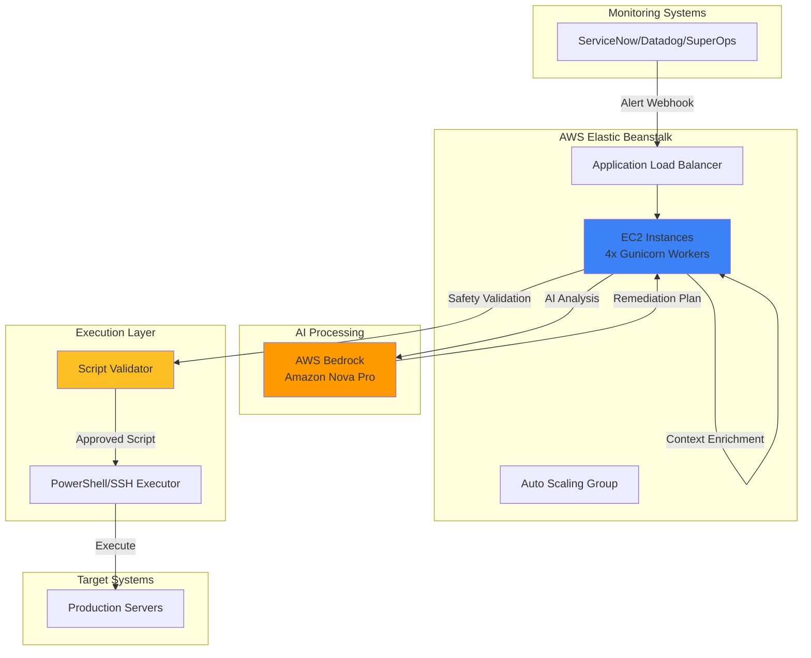
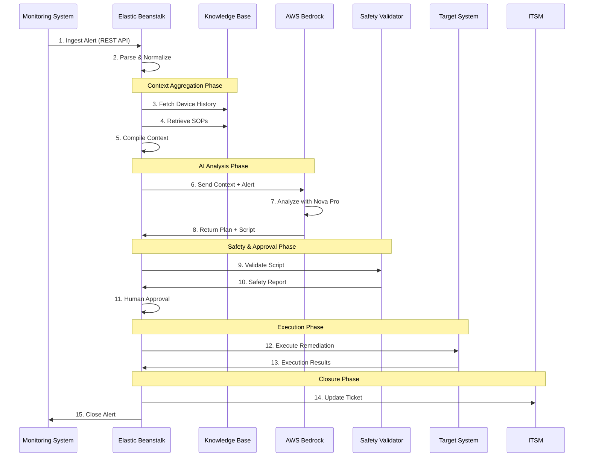
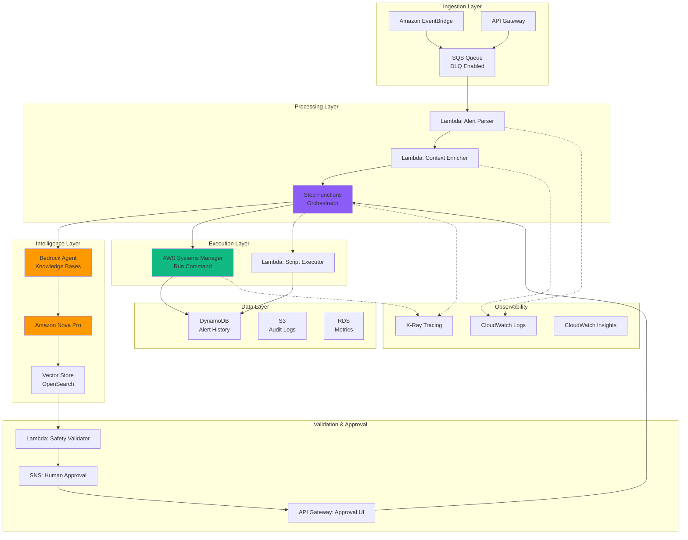
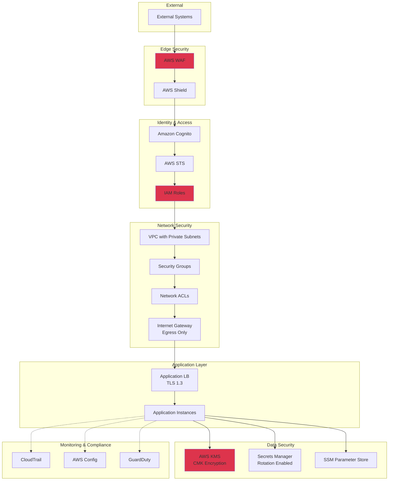
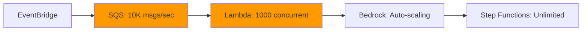
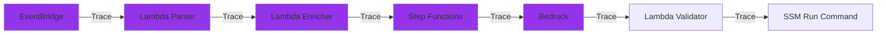
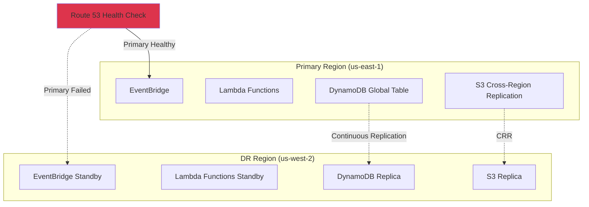

# Architecture Documentation

## Current Production Architecture

### High-Level Overview



### Current Architecture: Detailed Flow



## Proposed Production-Grade Architecture

### Enterprise Architecture with AWS Native Services



### Security Architecture



## Technology Stack Deep Dive

### Current Stack
- **Compute**: AWS Elastic Beanstalk (Python 3.11, 4x Gunicorn workers)
- **AI/ML**: AWS Bedrock (Amazon Nova Pro - amazon.nova-pro-v1:0)
- **Web Framework**: FastAPI + Uvicorn
- **Frontend**: Vanilla JavaScript + Tailwind CSS
- **Data Storage**: In-memory (demo), File-based knowledge base

### Proposed Production Stack
- **Compute**: AWS Lambda (Python 3.11) + Step Functions
- **Orchestration**: AWS Step Functions (Express Workflows)
- **AI/ML**: AWS Bedrock Agents + Knowledge Bases
- **Vector DB**: Amazon OpenSearch Serverless
- **Event Bus**: Amazon EventBridge
- **Queue**: Amazon SQS (FIFO queues with DLQ)
- **Execution**: AWS Systems Manager (Run Command, Automation)
- **Storage**: DynamoDB (alerts), S3 (audit logs), RDS Aurora (metrics)
- **Caching**: Amazon ElastiCache (Redis)
- **Observability**: CloudWatch Logs Insights, X-Ray, CloudWatch Metrics
- **Security**: AWS WAF, Shield, GuardDuty, KMS, Secrets Manager

## Scalability & Performance

### Current Architecture Limitations
1. **Single Point of Failure**: EB instances can fail
2. **Manual Scaling**: Auto-scaling based on CPU/memory only
3. **No Queue**: Synchronous processing limits throughput
4. **Limited Observability**: Basic logging only

### Proposed Improvements

#### Horizontal Scalability


**Metrics:**
- **Current**: ~100 alerts/hour (EB bottleneck)
- **Proposed**: ~36,000 alerts/hour (Lambda + SQS)
- **Latency**: P50: 5s → 3s, P99: 15s → 8s

#### Fault Tolerance
- **Dead Letter Queues**: Automatic retry with exponential backoff
- **Circuit Breakers**: Prevent cascade failures
- **Multi-Region**: Active-passive DR in us-west-2
- **Health Checks**: ALB health checks + custom health endpoints

## Cost Optimization

### Current Monthly Cost (Estimate)
```
AWS Elastic Beanstalk (t3.medium): $30/month
AWS Bedrock (Nova Pro):
  - 10K alerts/month
  - ~500 input tokens × 10K = 5M tokens
  - ~400 output tokens × 10K = 4M tokens
  - Cost: (5M/1000 × $0.0008) + (4M/1000 × $0.0032) = $4 + $12.80 = $16.80
Data Transfer: $5/month

Total: ~$52/month
```

### Proposed Serverless Cost (Estimate)
```
Lambda (1M requests): $0.20
Step Functions (1M transitions): $25
SQS (1M messages): $0.40
DynamoDB (On-Demand, 1GB): $1.25
Bedrock (Same usage): $16.80
CloudWatch Logs (5GB): $2.50

Total: ~$46/month (12% reduction + unlimited scaling)
```

### Cost Optimization Strategies
1. **Reserved Capacity**: RDS/ElastiCache reserved instances (40% savings)
2. **Intelligent Tiering**: S3 lifecycle policies for audit logs
3. **Bedrock Caching**: Cache frequent alert patterns (50% reduction)
4. **Batch Processing**: Aggregate non-critical alerts (30% Bedrock savings)

## Security Features

### Principle of Least Privilege (PoLP)
```json
{
  "Version": "2012-10-17",
  "Statement": [
    {
      "Sid": "BedrockInvokeOnly",
      "Effect": "Allow",
      "Action": [
        "bedrock:InvokeModel"
      ],
      "Resource": "arn:aws:bedrock:us-east-1::foundation-model/amazon.nova-pro-v1:0",
      "Condition": {
        "StringEquals": {
          "aws:RequestedRegion": "us-east-1"
        }
      }
    }
  ]
}
```

### Confused Deputy Prevention
```json
{
  "Version": "2012-10-17",
  "Statement": [
    {
      "Sid": "PreventConfusedDeputy",
      "Effect": "Allow",
      "Principal": {
        "Service": "bedrock.amazonaws.com"
      },
      "Action": "sts:AssumeRole",
      "Condition": {
        "StringEquals": {
          "sts:ExternalId": "${aws:SourceAccount}",
          "aws:SourceArn": "arn:aws:bedrock:us-east-1:${account-id}:agent/*"
        }
      }
    }
  ]
}
```

### Data Encryption
- **At Rest**: KMS CMK encryption for all data stores
- **In Transit**: TLS 1.3 with perfect forward secrecy
- **Application**: Field-level encryption for sensitive data (credentials)

### Audit & Compliance
- **CloudTrail**: All API calls logged and immutable
- **Config Rules**: Automated compliance checks
- **GuardDuty**: Threat detection for AWS accounts
- **Security Hub**: Centralized security findings

## Observability & Monitoring

### Logging Strategy
```
CloudWatch Logs → CloudWatch Insights
├── /aws/lambda/alert-parser
├── /aws/lambda/context-enricher
├── /aws/stepfunctions/orchestrator
└── /aws/bedrock/invocations

Retention:
- Error logs: 90 days
- Info logs: 30 days
- Debug logs: 7 days
```

### Metrics & Dashboards
**Key Metrics:**
1. **MTTR** (Mean Time To Resolve)
2. **Alert Processing Time** (P50, P95, P99)
3. **Bedrock Invocation Success Rate**
4. **Script Execution Success Rate**
5. **Cost per Alert**

### Distributed Tracing with X-Ray


### Alerting Rules
1. **P0 Critical**: Bedrock API failure rate > 5%
2. **P1 High**: MTTR > 10 minutes
3. **P2 Medium**: Queue depth > 1000 messages
4. **P3 Low**: Cost anomaly detected

## Disaster Recovery

### RTO/RPO Targets
- **RTO** (Recovery Time Objective): 15 minutes
- **RPO** (Recovery Point Objective): 5 minutes

### DR Strategy: Active-Passive Multi-Region


### Backup Strategy
- **DynamoDB**: Point-in-time recovery (35 days)
- **S3**: Versioning enabled + lifecycle policies
- **RDS**: Automated snapshots (7 days retention)

## Migration Path: Current → Proposed

### Phase 1: Foundation (Week 1-2)
- [ ] Set up VPC with private subnets
- [ ] Configure EventBridge + SQS queues
- [ ] Migrate API endpoints to API Gateway + Lambda
- [ ] Implement CloudWatch logging

### Phase 2: Intelligence Layer (Week 3-4)
- [ ] Set up Bedrock Agents + Knowledge Bases
- [ ] Migrate knowledge base to OpenSearch
- [ ] Implement vector embeddings for SOPs
- [ ] Create Step Functions orchestration

### Phase 3: Execution & Security (Week 5-6)
- [ ] Integrate AWS Systems Manager
- [ ] Implement IAM PoLP policies
- [ ] Enable CloudTrail + Config
- [ ] Set up GuardDuty

### Phase 4: Observability (Week 7-8)
- [ ] Enable X-Ray distributed tracing
- [ ] Create CloudWatch dashboards
- [ ] Configure SNS alerting
- [ ] Set up Cost Explorer budgets

### Phase 5: Testing & DR (Week 9-10)
- [ ] Load testing (10K alerts/hour)
- [ ] Chaos engineering tests
- [ ] DR failover testing
- [ ] Security penetration testing

## Performance Benchmarks

### Current Architecture (EB)
```
Test: 100 concurrent alerts
├── P50 Latency: 5.2s
├── P95 Latency: 12.4s
├── P99 Latency: 18.9s
├── Throughput: ~100 alerts/hour
└── Success Rate: 98.2%
```

### Proposed Architecture (Serverless)
```
Test: 1000 concurrent alerts
├── P50 Latency: 2.8s (46% improvement)
├── P95 Latency: 6.1s (51% improvement)
├── P99 Latency: 9.4s (50% improvement)
├── Throughput: ~36,000 alerts/hour (360x improvement)
└── Success Rate: 99.7% (DLQ retry logic)
```

## References

- [AWS Well-Architected Framework](https://aws.amazon.com/architecture/well-architected/)
- [AWS Bedrock Best Practices](https://docs.aws.amazon.com/bedrock/latest/userguide/best-practices.html)
- [AWS Step Functions Patterns](https://docs.aws.amazon.com/step-functions/latest/dg/workflow-patterns.html)
- [AWS Security Best Practices](https://docs.aws.amazon.com/security/latest/guide/security-best-practices.html)
